# Week 1 — App Containerization

During week 01, we did the follow activities:

| Activities                                                  | Youtube                                                                                      | Link                                                                                  | Status |
|-------------------------------------------------------------|----------------------------------------------------------------------------------------------|---------------------------------------------------------------------------------------| --- |
| Watch How to Ask for Technical Help                         | https://www.youtube.com/watch?v=tDPqmwKMP7Y&list=PLBfufR7vyJJ7k25byhRXJldB5AiwgNnWv&index=29 |                                                                                       | ✅      |
| Watched Grading Homework Summaries                          | https://www.youtube.com/watch?v=FKAScachFgk&list=PLBfufR7vyJJ7k25byhRXJldB5AiwgNnWv&index=25 |                                                                                       | ✅      |
| Watched Week 1 - Live Streamed Video                        | https://www.youtube.com/watch?v=zJnNe5Nv4tE&list=PLBfufR7vyJJ7k25byhRXJldB5AiwgNnWv&index=22 |                                                                                       |✅      |
| Watched Chirag's Week 1 - Spending Considerations           | https://www.youtube.com/watch?v=OAMHu1NiYoI&list=PLBfufR7vyJJ7k25byhRXJldB5AiwgNnWv&index=24 |                                                                                       |✅      |
| Watched Ashish's Week 1 - Container Security Considerations | https://www.youtube.com/watch?v=OjZz4D0B-cA&list=PLBfufR7vyJJ7k25byhRXJldB5AiwgNnWv&index=25 |                                                                                       | ✅      |
| Containerize Application (Dockerfiles, Docker Compose)      | https://www.youtube.com/watch?v=zJnNe5Nv4tE&list=PLBfufR7vyJJ7k25byhRXJldB5AiwgNnWv&index=22 | [Containerize Application (Dockerfiles, Docker Compose)](#Docker-Files)               | ✅      |
| Document the Notification Endpoint for the OpenAI Document  | https://www.youtube.com/watch?v=k-_o0cCpksk&list=PLBfufR7vyJJ7k25byhRXJldB5AiwgNnWv&index=27 | [Open Api Documentation](#Open-Api-Documentation)                                     | ✅      |
| Write a Flask Backend Endpoint for Notifications            | https://www.youtube.com/watch?v=k-_o0cCpksk&list=PLBfufR7vyJJ7k25byhRXJldB5AiwgNnWv&index=27 | [Flask Backend Endpoint for Notifications](#Flask-Backend-Endpoint-for-Notifications) | ✅      |
| Write a React Page for Notifications           | https://www.youtube.com/watch?v=k-_o0cCpksk&list=PLBfufR7vyJJ7k25byhRXJldB5AiwgNnWv&index=27 | [React Page for Notifications](#React-Page-for-Notifications)                         | ✅      |
| Run DynamoDB Local Container and ensure it works            | https://www.youtube.com/watch?v=CbQNMaa6zTg&list=PLBfufR7vyJJ7k25byhRXJldB5AiwgNnWv&index=28 | [Run Dynamo DB Container](#Run-Dynamo-DB-Container)                                   | ✅      |
| Run Postgres Container and ensure it works                  | https://www.youtube.com/watch?v=CbQNMaa6zTg&list=PLBfufR7vyJJ7k25byhRXJldB5AiwgNnWv&index=28 | [Run Postgres Container](#Run-Postgres-Container)                                     | ✅      |

# Docker Files
- [Dockerfile File for Backend](../backend-flask/Dockerfile)
- [Dockerfile File for Frontend](../frontend-react-js/Dockerfile)
- [Docker Compose](../docker-compose.yml) with support to postgresql and dynamo db **ONLY GITPOD ENV**

# Open Api Documentation
- [Open Api File](../backend-flask/openapi-3.0.yml)
- 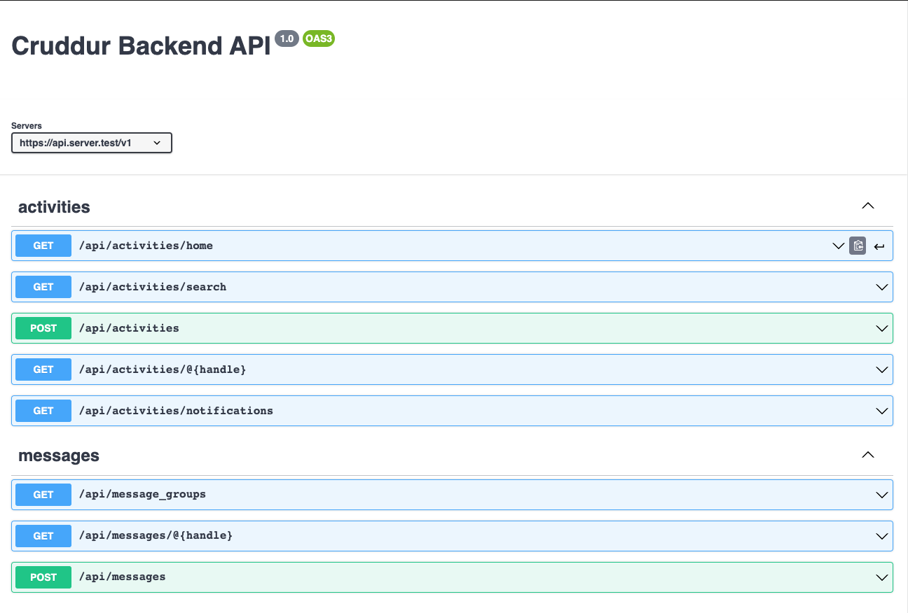

# Flask Backend Endpoint for Notifications
- 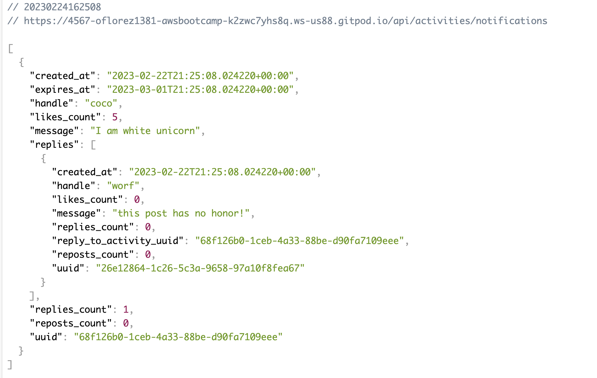

# React Page for Notifications
- 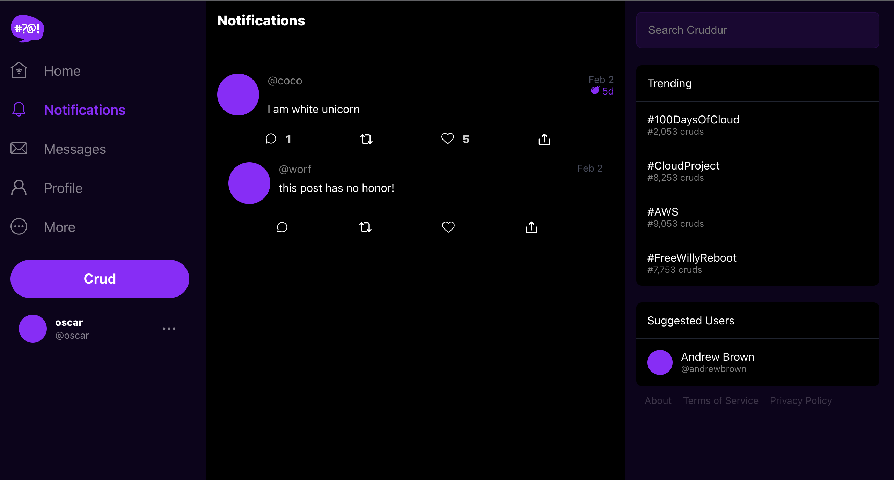

# Run Dynamo DB Container

## Create a table

```sh
aws dynamodb create-table \
    --endpoint-url http://localhost:8000 \
    --table-name Music \
    --attribute-definitions \
        AttributeName=Artist,AttributeType=S \
        AttributeName=SongTitle,AttributeType=S \
    --key-schema AttributeName=Artist,KeyType=HASH AttributeName=SongTitle,KeyType=RANGE \
    --provisioned-throughput ReadCapacityUnits=1,WriteCapacityUnits=1 \
    --table-class STANDARD
```
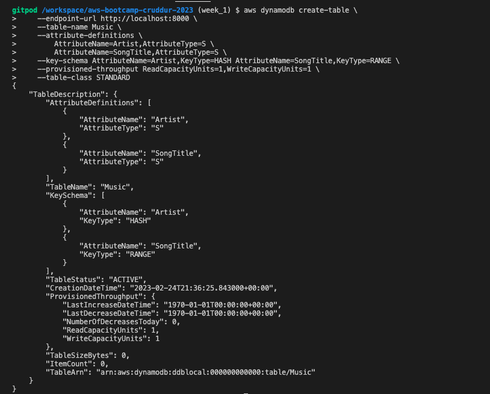

## Create an Item

```sh
aws dynamodb put-item \
    --endpoint-url http://localhost:8000 \
    --table-name Music \
    --item \
        '{"Artist": {"S": "No One You Know"}, "SongTitle": {"S": "Call Me Today"}, "AlbumTitle": {"S": "Somewhat Famous"}}' \
    --return-consumed-capacity TOTAL  
```
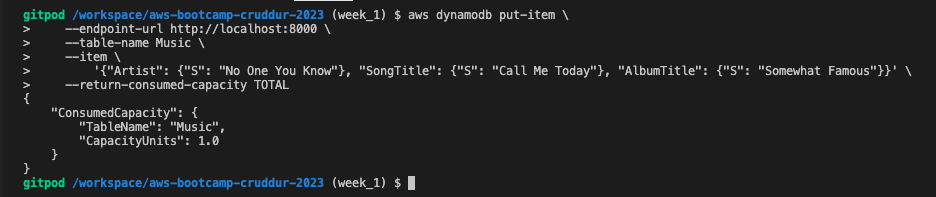

## List Tables

```sh
aws dynamodb list-tables --endpoint-url http://localhost:8000
```
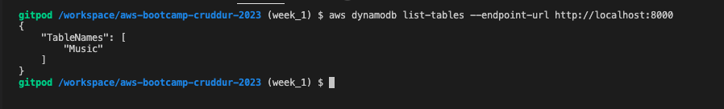

## Get Records

```sh
aws dynamodb scan --table-name Music --query "Items" --endpoint-url http://localhost:8000
````
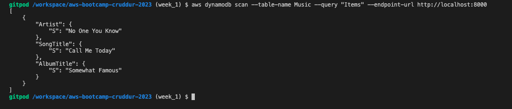


# Run Postgres Container

## Connect Postgres
```sh
psql -Upostgres --host localhost
```
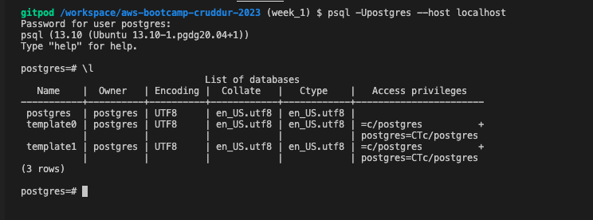

# Homework Challenges    

## Run the dockerfile CMD as an external script
- [Dockerfile File for Backend](../backend-flask/Dockerfile)
- [Dockerfile File for Frontend](../frontend-react-js/Dockerfile)
- [Docker Compose V2](../docker-compose-v2.yml) with support to postgresql and dynamo db local **ONLY LOCAL ENV**
  - ```sh
      docker compose -f docker-compose-v2.yml up
    ```
    
## Push and tag a image to DockerHub (they have a free tier)

### backend
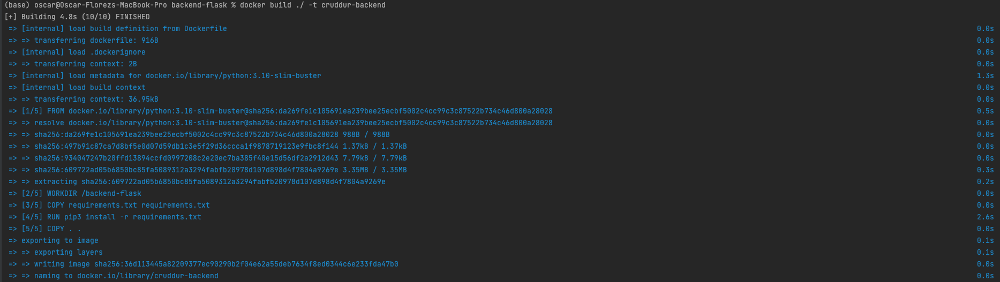
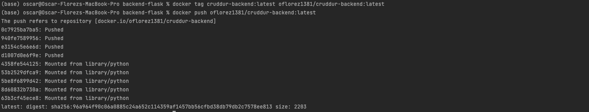


### frontend
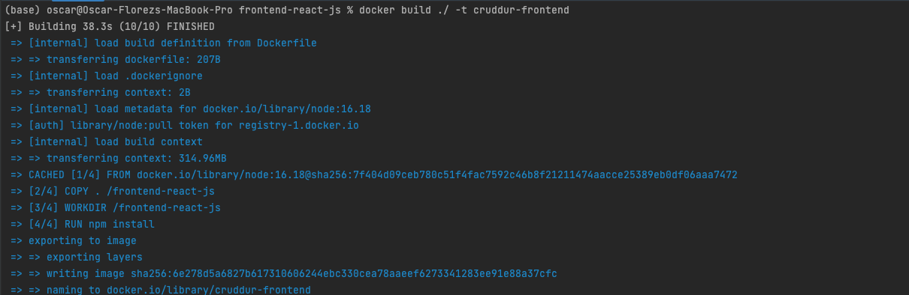
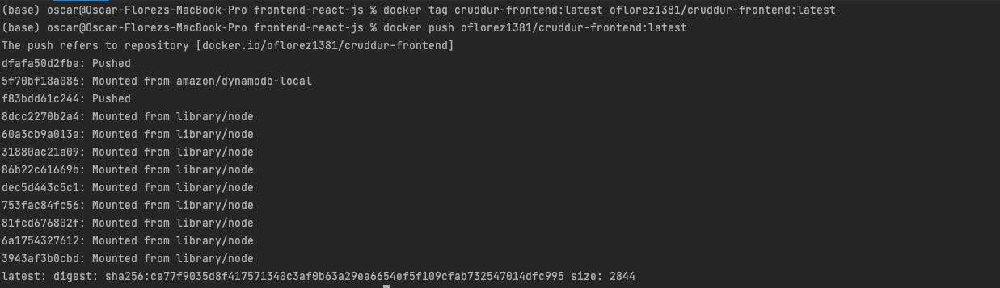


## Implement a healthcheck in the V3 Docker compose file
- [Docker Compose V3](../docker-compose-v3.yml) with support to postgresql and dynamo db local, healthcheck **ONLY LOCAL ENV**
  - ```sh
        docker compose -f docker-compose-v3.yml up
      ``` 
