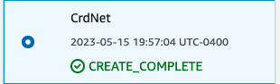
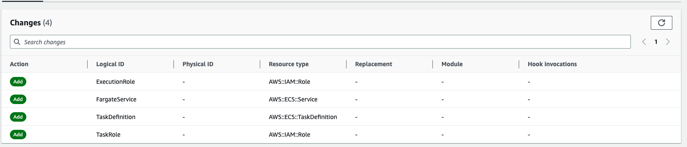
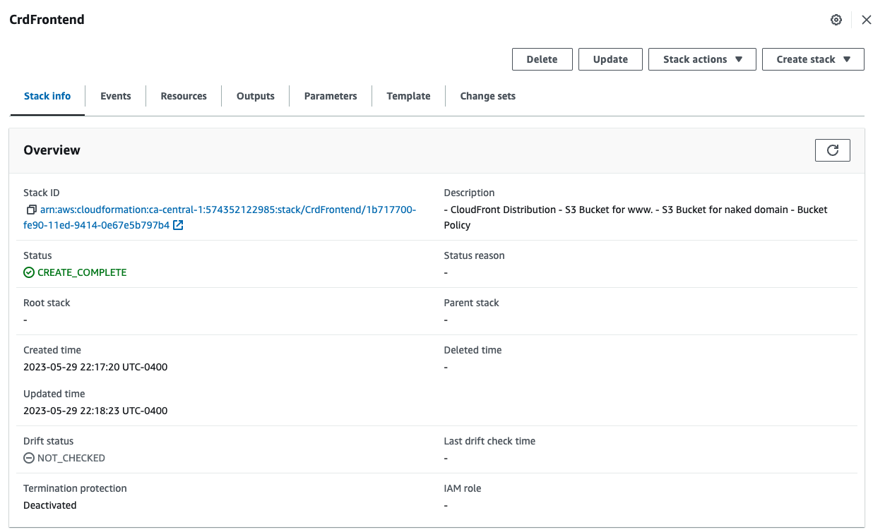

# Week 10 - 11 — CloudFormation

During week 10 - 11, we did the follow activities:

| Activities                                                                 | Youtube                                                                                        | Link                                                                                                    | Status |
|----------------------------------------------------------------------------|------------------------------------------------------------------------------------------------|---------------------------------------------------------------------------------------------------------|---|
| CFN Security with Ashish                                                   | https://www.youtube.com/watch?v=ctYnoDo5tWE&list=PLBfufR7vyJJ7k25byhRXJldB5AiwgNnWv&index=94   |                                                                                                         |   |
| Live-Stream Cloudformation (CFN) Basics                                    | https://www.youtube.com/watch?v=BRmEG4zicM0&list=PLBfufR7vyJJ7k25byhRXJldB5AiwgNnWv&index=85   |                                                                                                         | ✅ |
| Implement CFN Networking Layer                                             | https://www.youtube.com/watch?v=jPdm0uLyFLM&list=PLBfufR7vyJJ7k25byhRXJldB5AiwgNnWv&index=86   | [Implement CFN Networking Layer](#implement-cfn-networking-layer)                                       | ✅ |
| Implement CFN Networking Layer (Diagram)                                   | https://www.youtube.com/watch?v=lb3aKVVMn7U&list=PLBfufR7vyJJ7k25byhRXJldB5AiwgNnWv&index=87   |                                                                                                         |   |
| Implement CFN Cluster Layer                                                | https://www.youtube.com/watch?v=sdqWoOaeD2M&list=PLBfufR7vyJJ7k25byhRXJldB5AiwgNnWv&index=88   | [Implement CFN Cluster Layer](#implement-cfn-cluster-layer)                                             | ✅ |
| Implement CFN Toml                                                         | https://www.youtube.com/watch?v=ATv1Z-T0LKI&list=PLBfufR7vyJJ7k25byhRXJldB5AiwgNnWv&index=89   |                                                                                                         | ✅ |
| Implement CFN Service Layer for Backend                                    | https://www.youtube.com/watch?v=yj8QK8YULCQ&list=PLBfufR7vyJJ7k25byhRXJldB5AiwgNnWv&index=93   | [Implement CFN Service Layer for Backend](#implement-cfn-service-layer-for-backend)                     | ✅ |
| Implement CFN Database Layer (RDS)                                         | https://www.youtube.com/watch?v=BNZfYl_82ZU&list=PLBfufR7vyJJ7k25byhRXJldB5AiwgNnWv&index=97   | [Implement CFN Database Layer](#implement-cfn-database-layer)                                           | ✅ |
| Implement Service and Database (Diagram)                                   | https://www.youtube.com/watch?v=y6ShAco6Edg&list=PLBfufR7vyJJ7k25byhRXJldB5AiwgNnWv&index=102  |                                                                                                         |   |
| Implement DynamoDB using SAM                                               | https://www.youtube.com/watch?v=8UGa4q-zRJ8&list=PLBfufR7vyJJ7k25byhRXJldB5AiwgNnWv&index=103  |                                                                                                         | ✅ |
| Implement DynamoDB (Diagram)                                               | https://www.youtube.com/watch?v=ZK5PdSbxpH0&list=PLBfufR7vyJJ7k25byhRXJldB5AiwgNnWv&index=105  |                                                                                                         |   |
| Implement CI/CD                                                            | https://www.youtube.com/watch?v=8EY4UwON7y8&list=PLBfufR7vyJJ7k25byhRXJldB5AiwgNnWv&index=106  | [Implement CI/CD](#implement-ci/cd)                                                                     | ✅ |
| Implement CI/CD (Diagram)                                                  | https://www.youtube.com/watch?v=bmS-z2J7oTs&list=PLBfufR7vyJJ7k25byhRXJldB5AiwgNnWv&index=108  |                                                                                                         |   |
| Implement CFN Static Website Hosting for Frontend                          | https://www.youtube.com/watch?v=Qc96g_blibA&list=PLBfufR7vyJJ7k25byhRXJldB5AiwgNnWv&index=109  | [Implement CFN Static Website Hosting for Frontend](#implement-cfn-static-website-hosting-for-frontend) | ✅ |
| CFN Diagramming Static Frontend                                            | https://www.youtube.com/watch?v=IEBHegBqne0&list=PLBfufR7vyJJ7k25byhRXJldB5AiwgNnWv&index=110  |                                                                                                         |   |

## Implement CFN Networking Layer

## Implement CFN Cluster Layer 

## Implement CFN Service Layer for Backend  

## Implement CFN Database Layer

## Implement CI/CD 

## Implement CFN Static Website Hosting for Frontend

