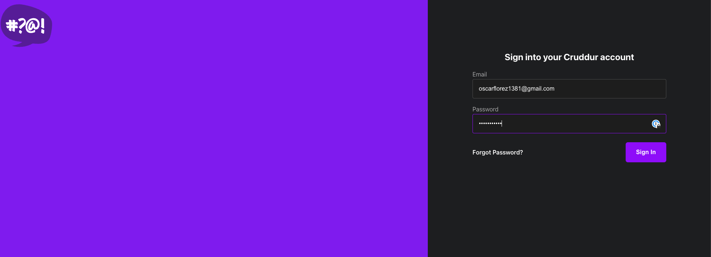

# Week 3 — Decentralized Authentication

During week 03, we did the follow activities:

| Activities                                                      | Youtube                                        | Link                                                              | Status |
|-----------------------------------------------------------------|------------------------------------------------|-------------------------------------------------------------------| -- |
| Watch Ashish's Week 3 - Decentralized Authentication            | https://www.youtube.com/watch?v=tEJIeII66pY&list=PLBfufR7vyJJ7k25byhRXJldB5AiwgNnWv&index=39 | |✅|
| Watch Chirag Week 3 - Spending Considerations                   | |  |  |
| Setup Cognito User Pool                                         | https://www.youtube.com/watch?v=9obl7rVgzJw&list=PLBfufR7vyJJ7k25byhRXJldB5AiwgNnWv&index=40 | [Setup Cognito User Pool](#Setup-Cognito-User-Pool) |✅|
| Implement Custom Signin Page                                    | https://www.youtube.com/watch?v=9obl7rVgzJw&list=PLBfufR7vyJJ7k25byhRXJldB5AiwgNnWv&index=40 | [Implement Custom Signup Page](#Implement-Custom-Signup-Page) |✅|
| Implement Custom Signup Page                                    | https://www.youtube.com/watch?v=T4X4yIzejTc&list=PLBfufR7vyJJ7k25byhRXJldB5AiwgNnWv&index=41 | [Implement Custom Signin Page](#Implement-Custom-Signin-Page) |✅|
| Implement Custom Confirmation Page                              | https://www.youtube.com/watch?v=T4X4yIzejTc&list=PLBfufR7vyJJ7k25byhRXJldB5AiwgNnWv&index=41 | [Implement Custom Confirmation and Recovery Page](Implement-Custom-Confirmation-and-Recovery-Page) |✅|
| Implement Custom Recovery Page                                  | https://www.youtube.com/watch?v=T4X4yIzejTc&list=PLBfufR7vyJJ7k25byhRXJldB5AiwgNnWv&index=41 | [Implement Custom Confirmation and Recovery Page](Implement-Custom-Confirmation-and-Recovery-Page)|✅|
| Cognito JWT Server Side Verify                                  | https://www.youtube.com/watch?v=d079jccoG-M | |✅|
| Watch about different approaches to verifying JWTs              | https://www.youtube.com/watch?v=nJjbI4BbasU&list=PLBfufR7vyJJ7k25byhRXJldB5AiwgNnWv&index=43 | |✅|

# Setup Cognito User Pool

# Home

# Implement Custom Signup Page

# Implement Custom Confirmation and Recovery Page

# Implement Custom Signin Page

# User Logged

