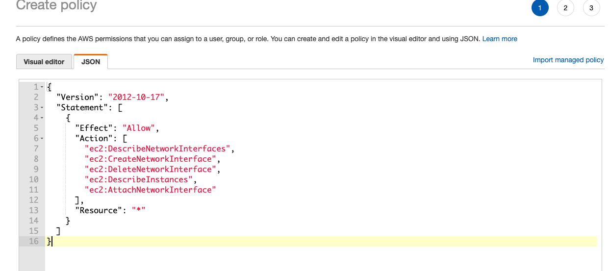
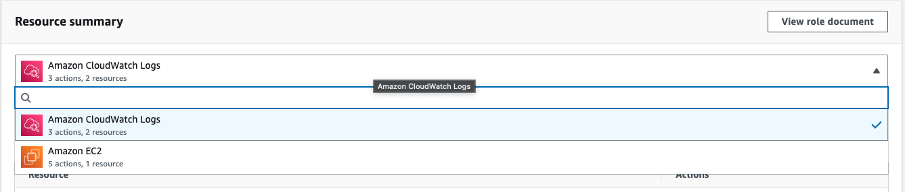

# Week 4 — Postgres and RDS

During week 04, we did the follow activities:

| Activities                                                      | Youtube                                        | Link                                                              | Status |
|-----------------------------------------------------------------|------------------------------------------------|-------------------------------------------------------------------| -- |
| Watched Ashish's Week 4 - Security Considerations               | https://www.youtube.com/watch?v=UourWxz7iQg&list=PLBfufR7vyJJ7k25byhRXJldB5AiwgNnWv&index=45 | |✅|
| Create RDS Postgres Instance                                    | https://www.youtube.com/watch?v=EtD7Kv5YCUs&list=PLBfufR7vyJJ7k25byhRXJldB5AiwgNnWv&index=46 | |✅|
| Bash scripting for common database actions                      | https://www.youtube.com/watch?v=EtD7Kv5YCUs&list=PLBfufR7vyJJ7k25byhRXJldB5AiwgNnWv&index=46 | |✅|
| Install Postgres Driver in Backend Application                  | https://www.youtube.com/watch?v=Sa2iB33sKFo&list=PLBfufR7vyJJ7k25byhRXJldB5AiwgNnWv&index=47 | |✅|
| Connect Gitpod to RDS Instance                                  | https://www.youtube.com/watch?v=Sa2iB33sKFo&list=PLBfufR7vyJJ7k25byhRXJldB5AiwgNnWv&index=47 | |✅|
| Create Cognito Trigger to insert user into database             | https://www.youtube.com/watch?v=7qP4RcY2MwU&list=PLBfufR7vyJJ7k25byhRXJldB5AiwgNnWv&index=48 | |✅|
| Create new activities with a database insert                    | https://www.youtube.com/watch?v=fTksxEQExL4&list=PLBfufR7vyJJ7k25byhRXJldB5AiwgNnWv&index=49 | | |

