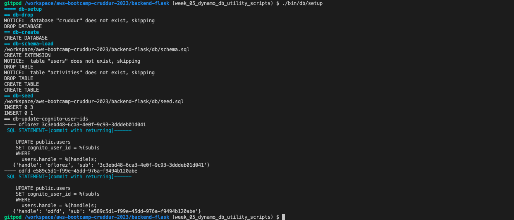
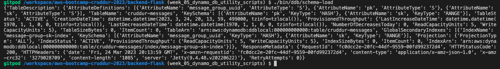
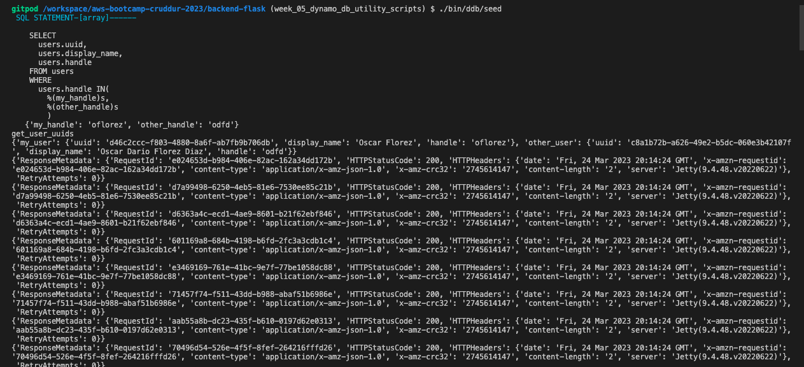
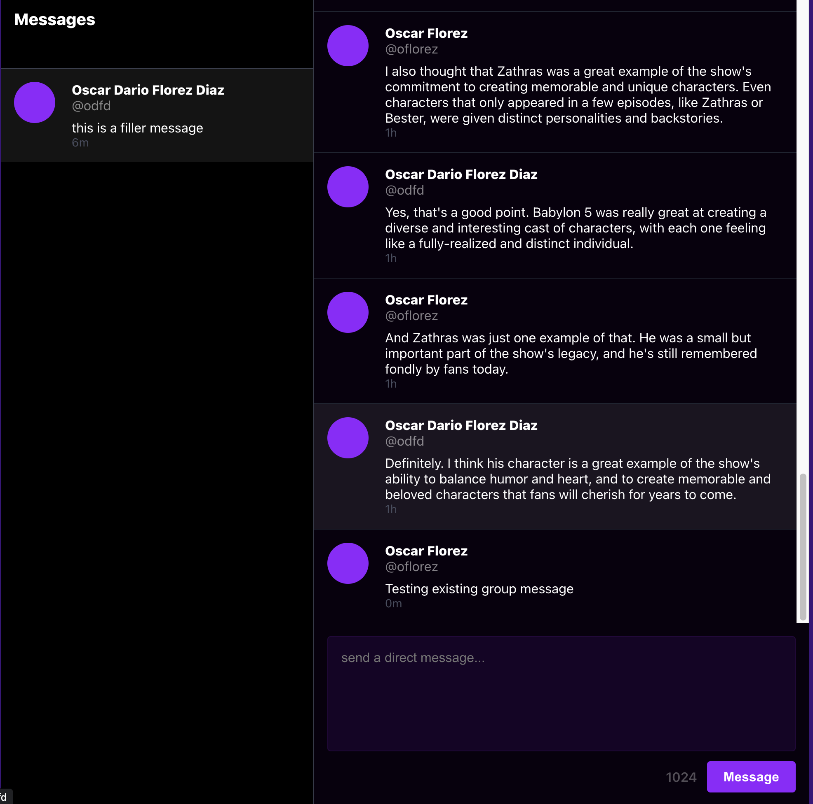
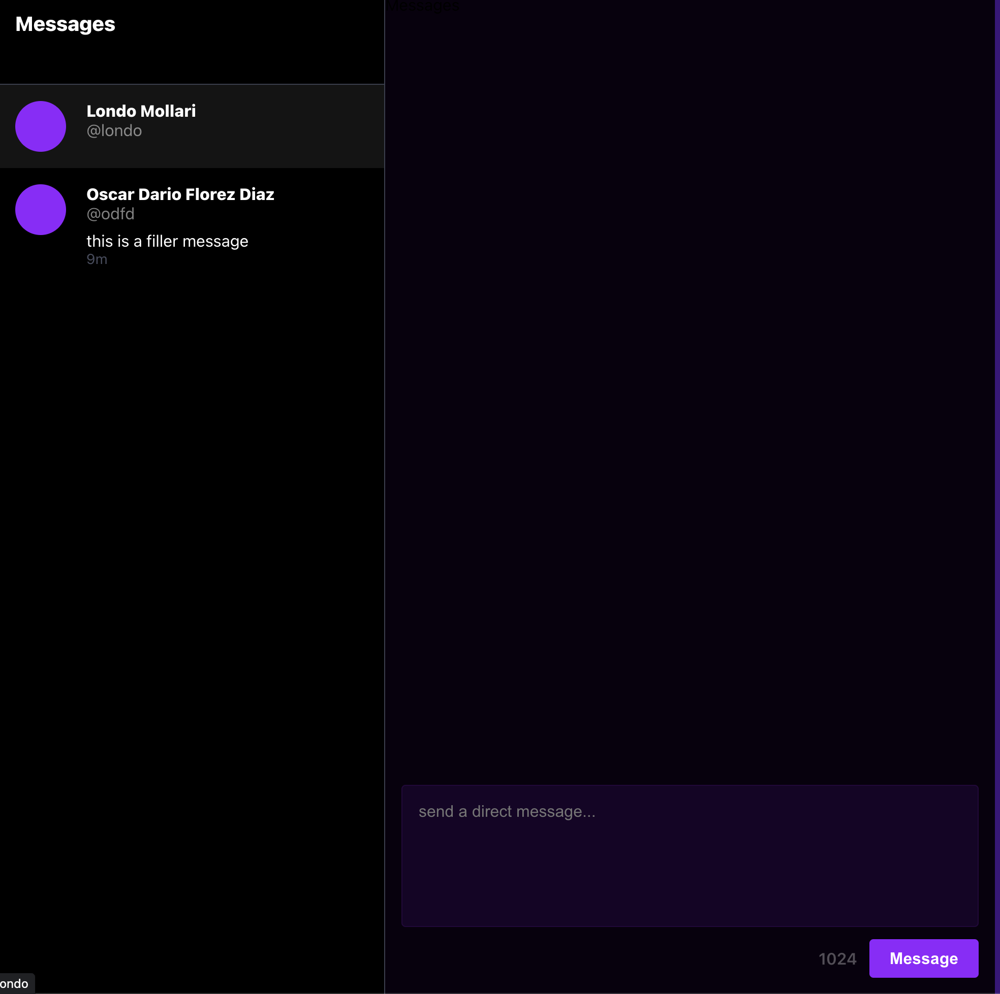
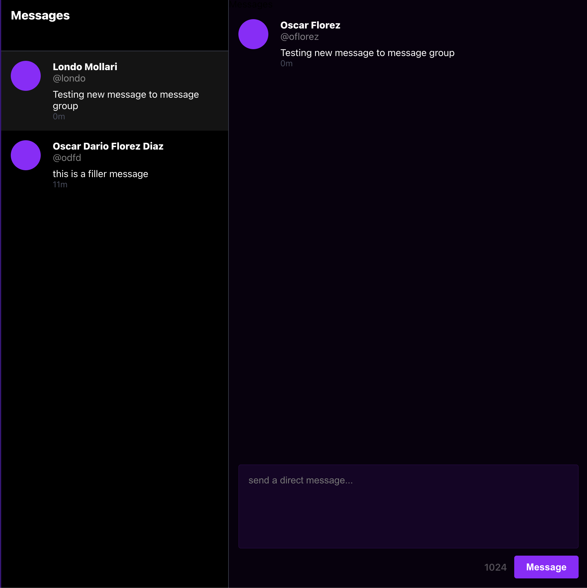

# Week 5 — DynamoDB and Serverless Caching
During week 05, we did the follow activities:

| Activities                                                      | Youtube                                        | Link                                                              | Status |
|-----------------------------------------------------------------|------------------------------------------------|-------------------------------------------------------------------| -- |
| Watched Week 5 - Data Modelling (Live Stream)                   | https://www.youtube.com/watch?v=5oZHNOaL8Og&list=PLBfufR7vyJJ7k25byhRXJldB5AiwgNnWv&index=50 | |✅|
| Watched Ashish's Week 5 - DynamoDB Considerations               | https://www.youtube.com/watch?v=gFPljPNnK2Q&list=PLBfufR7vyJJ7k25byhRXJldB5AiwgNnWv&index=52 | |✅|
| Implement Schema Load Script                                    | https://www.youtube.com/watch?v=pIGi_9E_GwA&list=PLBfufR7vyJJ7k25byhRXJldB5AiwgNnWv&index=52 |[implement script load script](#implement-script-load-script) |✅|
| Implement Seed Script                                           | https://www.youtube.com/watch?v=pIGi_9E_GwA&list=PLBfufR7vyJJ7k25byhRXJldB5AiwgNnWv&index=52 |[implement seed script](#implement-seed-script)|✅|
| Implement Scan Script                                           | https://www.youtube.com/watch?v=pIGi_9E_GwA&list=PLBfufR7vyJJ7k25byhRXJldB5AiwgNnWv&index=52 | |✅|
| Implement Pattern Scripts for Read and List Conversations       | https://www.youtube.com/watch?v=pIGi_9E_GwA&list=PLBfufR7vyJJ7k25byhRXJldB5AiwgNnWv&index=52 | |✅|
| Implement Update Cognito ID Script for Postgres Database        | https://www.youtube.com/watch?v=dWHOsXiAIBU&list=PLBfufR7vyJJ7k25byhRXJldB5AiwgNnWv&index=54 | |✅|
| Implement (Pattern A) Listing Messages in Message Group into Application        | https://www.youtube.com/watch?v=dWHOsXiAIBU&list=PLBfufR7vyJJ7k25byhRXJldB5AiwgNnWv&index=54 | [implement pattern a](#implements-pattern-a)|✅|
| Implement (Pattern B) Listing Messages Group into Application        | https://www.youtube.com/watch?v=dWHOsXiAIBU&list=PLBfufR7vyJJ7k25byhRXJldB5AiwgNnWv&index=54 | [implement pattern b](#implement-pattern-b) |✅|
| Implement (Pattern C) Creating a Message for an existing Message Group into Application      | https://www.youtube.com/watch?v=dWHOsXiAIBU&list=PLBfufR7vyJJ7k25byhRXJldB5AiwgNnWv&index=54 | [implement pattern c](#implement-pattern-c)|✅|
| Implement (Pattern D) Creating a Message for a new Message Group into Application        | https://www.youtube.com/watch?v=dWHOsXiAIBU&list=PLBfufR7vyJJ7k25byhRXJldB5AiwgNnWv&index=54 | [implement pattern d](#implement-pattern-d)|✅|
| Implement (Pattern E) Updating a Message Group using DynamoDB Streams        | https://www.youtube.com/watch?v=zGnzM_YdMJU&list=PLBfufR7vyJJ7k25byhRXJldB5AiwgNnWv&index=55 | [DynamoDB Stream trigger to update message groups](#DynamoDB-Stream-trigger-to-update-message-groups)|✅|

## setup postgresql db


## implement schema load script


## implement seed script


## implements pattern A

A user wants to see a list of messages that belong to a message group
The messages must be ordered by the created_at timestamp from newest to oldest (DESC)

```sql
SELECT
  messages.uuid,
  messages.display_name,
  messages.message,
  messages.handle,
  messages.created_at -- sk
FROM messages
WHERE
  messages.message_group_uuid = {{message_group_uuid}} -- pk
ORDER BY messages.created_at DESC
```

## implements pattern B
A user wants to see a list of previous conversations.
These conversations are listed from newest to oldest (DESC)
We want to see the other person we are talking to.
We want to see the last message (from whomever) in summary.

```sql
SELECT
  message_groups.uuid,
  message_groups.other_user_uuid,
  message_groups.other_user_display_name,
  message_groups.other_user_handle,
  message_groups.last_message,
  message_groups.last_message_at
FROM message_groups
WHERE
  message_groups.user_uuid = {{user_uuid}} --pk
ORDER BY message_groups.last_message_at DESC
```

## implement pattern C
```sql
INSERT INTO messages (
  user_uuid,
  display_name,
  handle,
  creaed_at
)
VALUES (
  {{user_uuid}},
  {{display_name}},
  {{handle}},
  {{created_at}}
);
```


## implement pattern D

When a user creates a message we need to update the conversation
to display the last message information for the conversation

```sql
UPDATE message_groups
SET 
  other_user_uuid = {{other_user_uuid}}
  other_user_display_name = {{other_user_display_name}}
  other_user_handle = {{other_user_handle}}
  last_message = {{last_message}}
  last_message_at = {{last_message_at}}
WHERE 
  message_groups.uuid = {{message_group_uuid}}
  AND message_groups.user_uuid = {{user_uuid}}
```



## DynamoDB Stream trigger to update message groups

- create a VPC endpoint for dynamoDB service on your VPC
- create a Python lambda function in your vpc
- enable streams on the table with 'new image' attributes included
- add your function as a trigger on the stream
- grant the lambda IAM role permission to read the DynamoDB stream events `AWSLambdaInvocation-DynamoDB`
- grant the lambda IAM role permission to update table items


**The Function**

```cruddur-messaging-stream.py
def lambda_handler(event, context):
    print('event-data',event)

    eventName = event['Records'][0]['eventName']
    if (eventName == 'REMOVE'):
        print("skip REMOVE event")
        return
    pk = event['Records'][0]['dynamodb']['Keys']['pk']['S']
    sk = event['Records'][0]['dynamodb']['Keys']['sk']['S']
    if pk.startswith('MSG#'):
        group_uuid = pk.replace("MSG#","")
        message = event['Records'][0]['dynamodb']['NewImage']['message']['S']
        print("GRUP ===>",group_uuid,message)

        table_name = 'cruddur-messages'
        index_name = 'message-group-sk-index'
        table = dynamodb.Table(table_name)
        data = table.query(
            IndexName=index_name,
            KeyConditionExpression=Key('message_group_uuid').eq(group_uuid)
        )
        print("RESP ===>",data['Items'])

        # recreate the message group rows with new SK value
        for i in data['Items']:
            delete_item = table.delete_item(Key={'pk': i['pk'], 'sk': i['sk']})
            print("DELETE ===>",delete_item)

            response = table.put_item(
                Item={
                    'pk': i['pk'],
                    'sk': sk,
                    'message_group_uuid':i['message_group_uuid'],
                    'message':message,
                    'user_display_name': i['user_display_name'],
                    'user_handle': i['user_handle'],
                    'user_uuid': i['user_uuid']
                }
            )
            print("CREATE ===>",response)
```