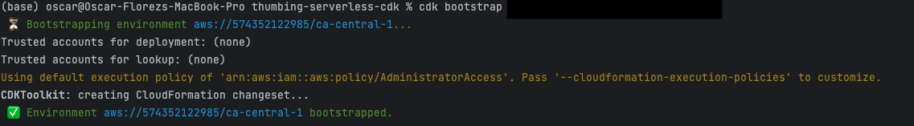
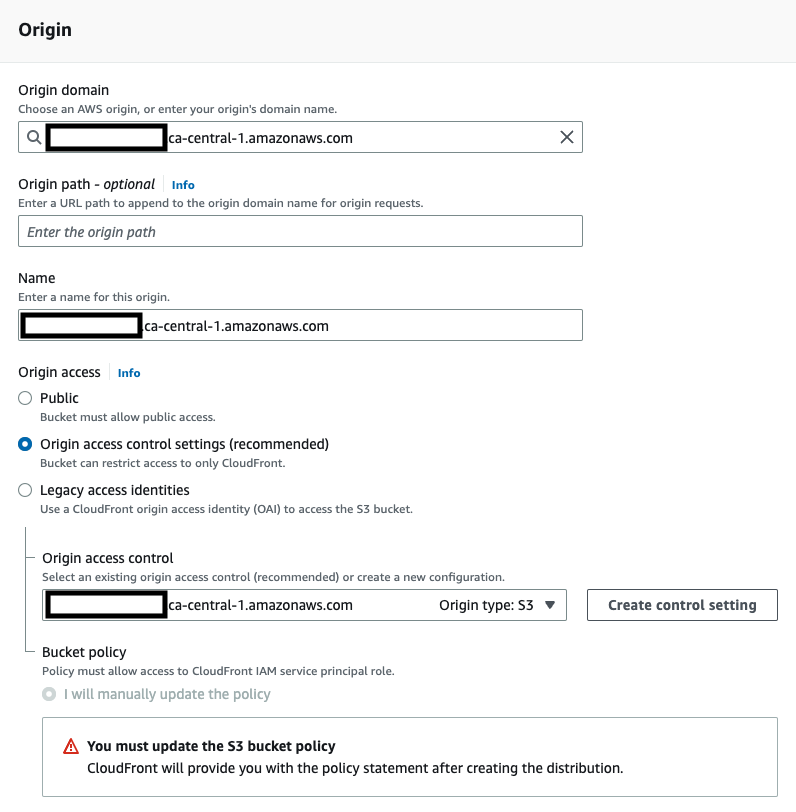
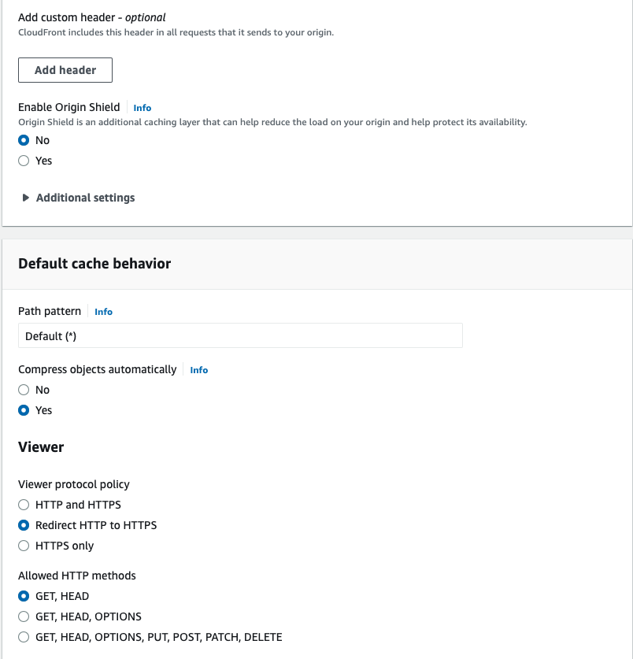
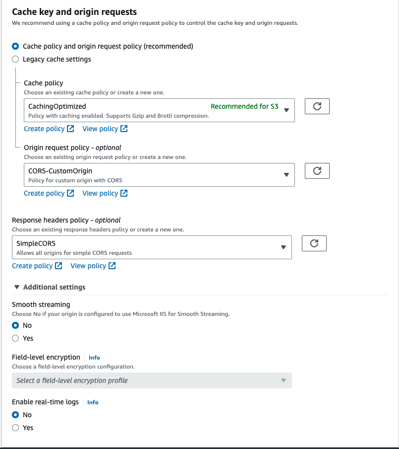
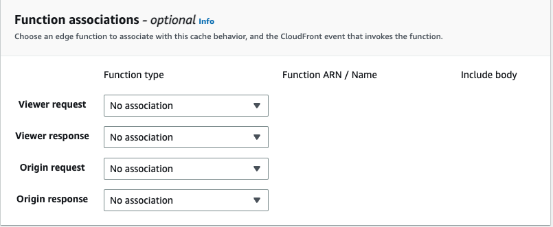
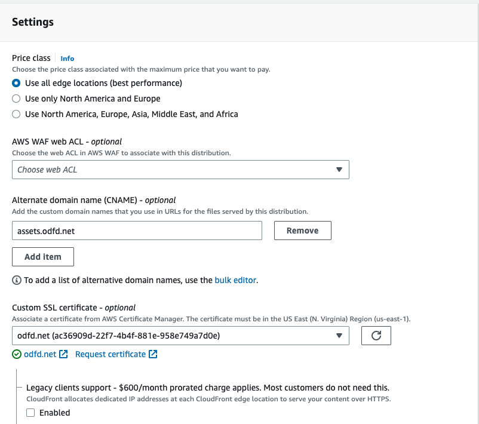
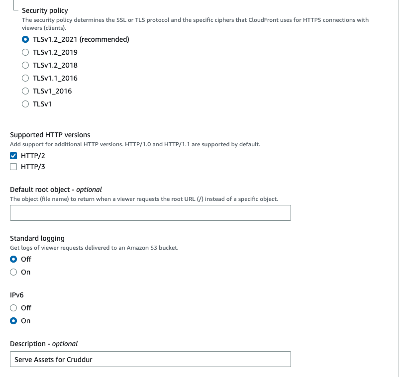
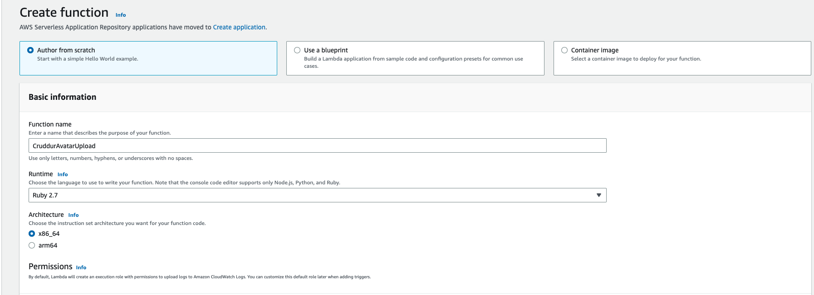
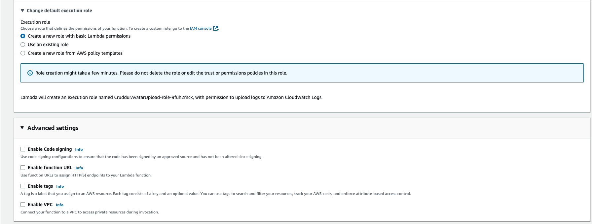
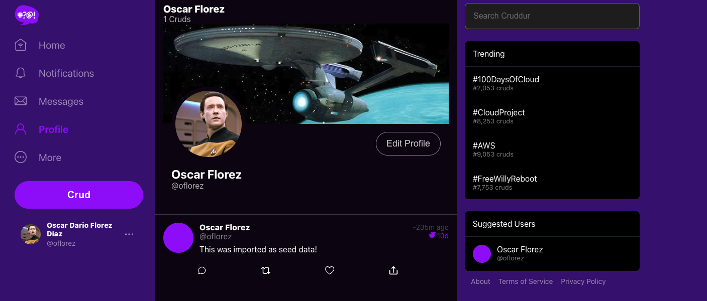

# Week 8 — Serverless Image Processing
During week 08, we did the follow activities:

| Activities                                                                | Youtube                                                                                      | Link                                                                                  | Status |
|---------------------------------------------------------------------------|----------------------------------------------------------------------------------------------|---------------------------------------------------------------------------------------| -- |
| Implement CDK Stack                                                       | https://www.youtube.com/watch?v=YiSNlK4bk90&list=PLBfufR7vyJJ7k25byhRXJldB5AiwgNnWv&index=72 | [Implement CDK Stack](#implement-cdk-stack)                                           |✅|
| Serve Avatars via CloudFront                                              | https://www.youtube.com/watch?v=Hl5XVb7dL6I&list=PLBfufR7vyJJ7k25byhRXJldB5AiwgNnWv&index=74 | [Serve Avatars via CloudFront](#serve-avatars-via-cloudfront)                         |✅|
| Implement Users Profile Page                                              | https://www.youtube.com/watch?v=WdVPx-LLjQ8&list=PLBfufR7vyJJ7k25byhRXJldB5AiwgNnWv&index=75 |                                                                                       |✅|
| Implement Users Profile Form                                              | https://www.youtube.com/watch?v=PTafksks528&list=PLBfufR7vyJJ7k25byhRXJldB5AiwgNnWv&index=76 |                                                                                       |✅|
| Implement Backend Migrations                                              | https://www.youtube.com/watch?v=PTafksks528&list=PLBfufR7vyJJ7k25byhRXJldB5AiwgNnWv&index=76 |                                                                                       |✅|
| Presigned URL generation via Ruby Lambda                                  | https://www.youtube.com/watch?v=Bk2tq4pliy8&list=PLBfufR7vyJJ7k25byhRXJldB5AiwgNnWv&index=77 | [Presigned URL generation via Ruby Lambda](#presigned-url-generation-via-ruby-lambda) |✅|
| HTTP API Gateway with Lambda Authorizer                                   | https://www.youtube.com/watch?v=Bk2tq4pliy8&list=PLBfufR7vyJJ7k25byhRXJldB5AiwgNnWv&index=77 |                                                                                       |✅|
| Create JWT Lambda Layer                                                   | https://www.youtube.com/watch?v=uWhdz5unipA&list=PLBfufR7vyJJ7k25byhRXJldB5AiwgNnWv&index=79 |                                                                                       |✅|
| Render Avatars in App via CloudFront                                      | https://www.youtube.com/watch?v=xrFo3QLoBp8&list=PLBfufR7vyJJ7k25byhRXJldB5AiwgNnWv&index=80 | [Render Avatars in App via CloudFront](#render-avatars-in-app-via-cloudfront)         |✅|

## Implement CDK Stack

## Serve Avatars via CloudFront

## Presigned URL generation via Ruby Lambda

## Render Avatars in App via CloudFront 
