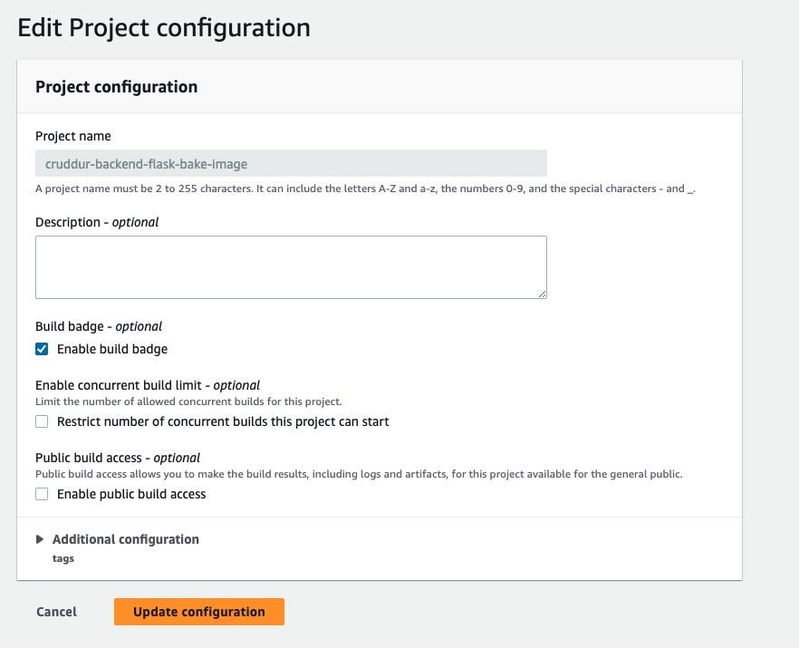
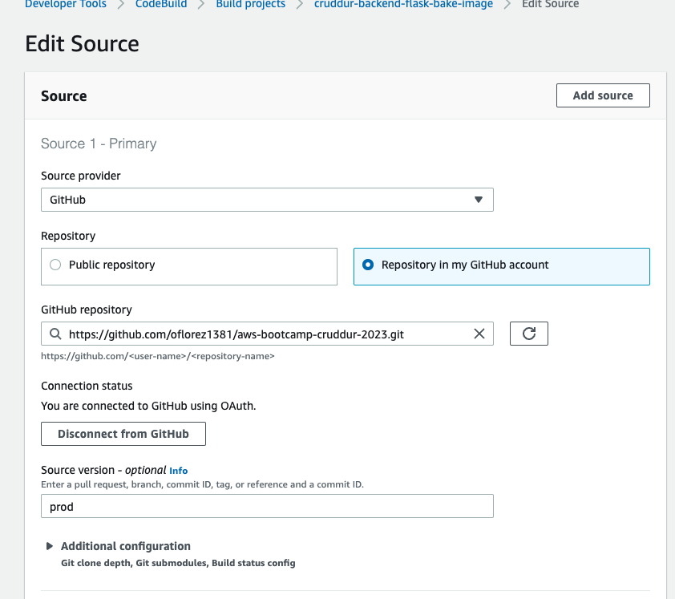
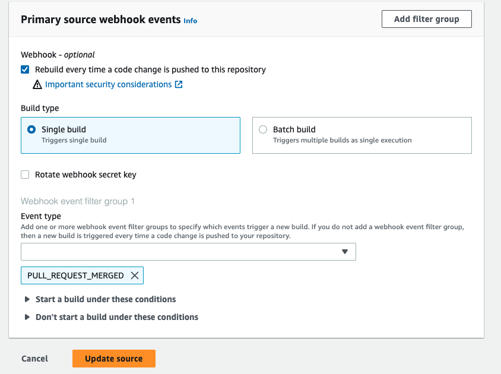
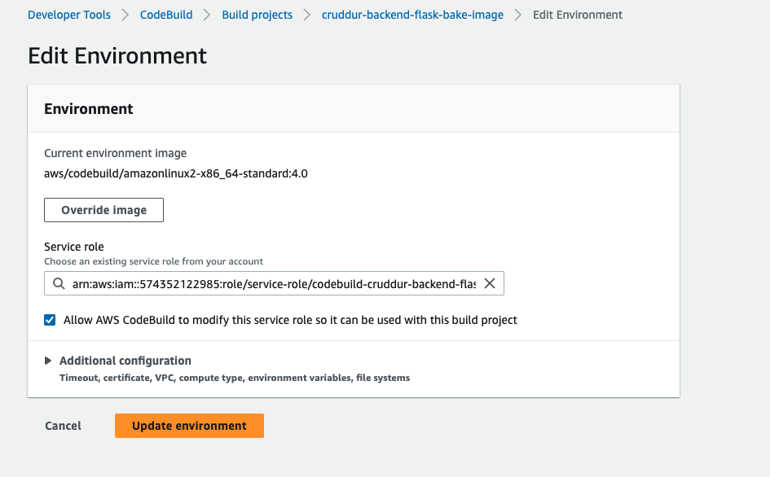
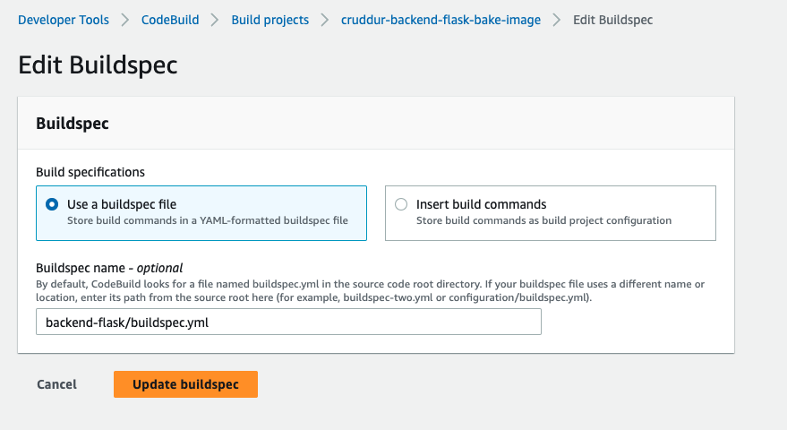
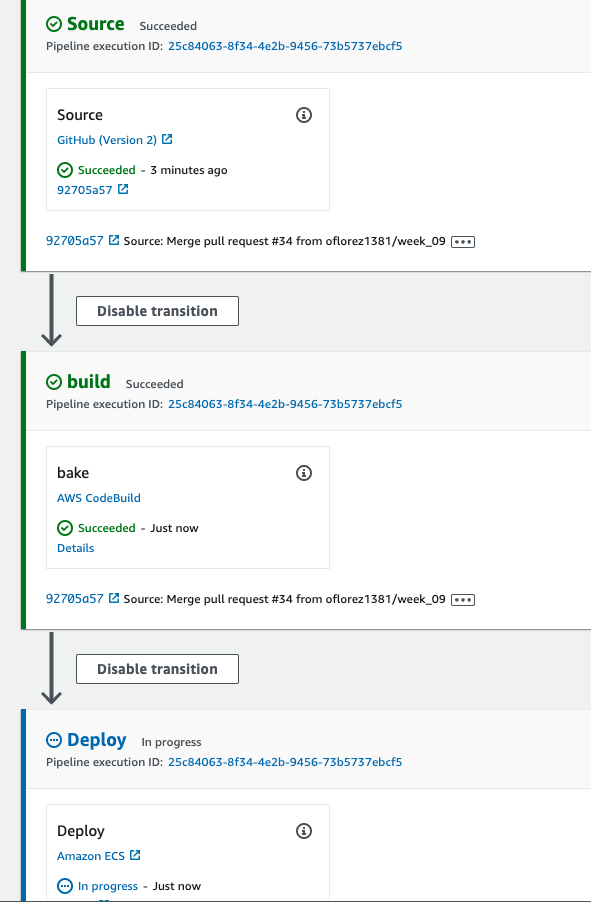
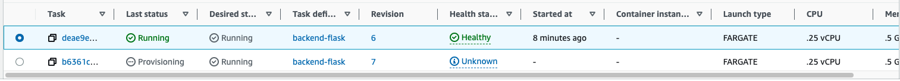
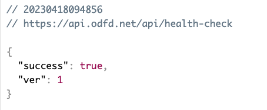
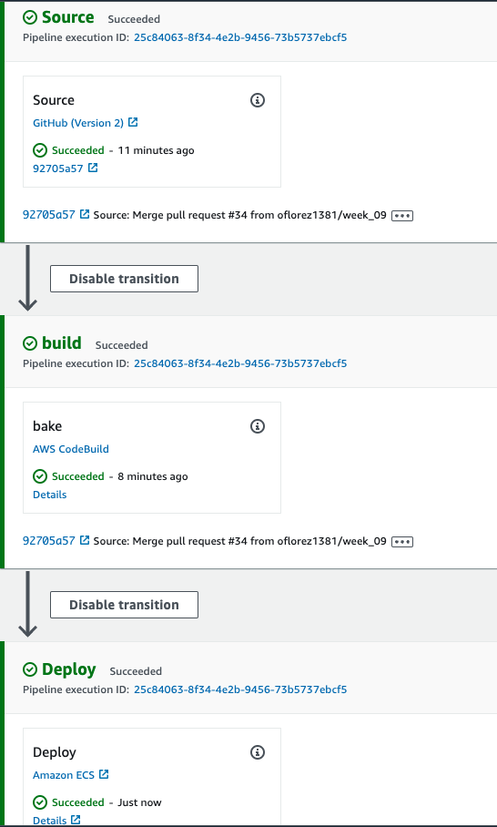

# Week 9 — CI/CD with CodePipeline, CodeBuild and CodeDeploy
During week 09, we did the follow activities:

| Activities                         | Youtube                                                                             | Link | Status |
|------------------------------------|-------------------------------------------------------------------------------------|------| -- |
| Configuring CodeBuild Part 1       | https://www.youtube.com/watch?v=DLYfI0ehMZE&list=PLBfufR7vyJJ7k25byhRXJldB5AiwgNnWv |      |✅|
| Configuring CodeBuild Part 2       | https://www.youtube.com/watch?v=py2E1f0IZg0&list=PLBfufR7vyJJ7k25byhRXJldB5AiwgNnWv |      |✅|
| Configuring CodePipeline           | https://www.youtube.com/watch?v=EAudiRT9Alw&list=PLBfufR7vyJJ7k25byhRXJldB5AiwgNnWv |      |✅|
| CICD Pipeline Security             | https://www.youtube.com/watch?v=-8zEyHdBJDA                                         |      |✅|

## Configuration






## Fix CodeBuild


```yaml
    runtime-versions:
      docker: 20
    commands:
      - echo "cd into $CODEBUILD_SRC_DIR/backend"
      - cd $CODEBUILD_SRC_DIR/backend-flask
      - "aws ecr get-login-password --region $AWS_DEFAULT_REGION | docker login --username AWS --password-stdin $IMAGE_URL"
  build:
    commands:
      - echo Build started on `date`
      - echo Building the Docker image...
      - docker build -t backend-flask .
      - "docker tag $REPO_NAME $IMAGE_URL/$REPO_NAME"
  post_build:
    commands:
      - echo Build completed on `date`
      - echo Pushing the Docker image..
      - "docker push $IMAGE_URL/$REPO_NAME"
      - cd $CODEBUILD_SRC_DIR
      - echo "imagedefinitions.json > [{\"name\":\"$CONTAINER_NAME\",\"imageUri\":\"$IMAGE_URL/$REPO_NAME\"}]" > imagedefinitions.json
      - printf "[{\"name\":\"$CONTAINER_NAME\",\"imageUri\":\"$IMAGE_URL/$REPO_NAME\"}]" > imagedefinitions.json
```



